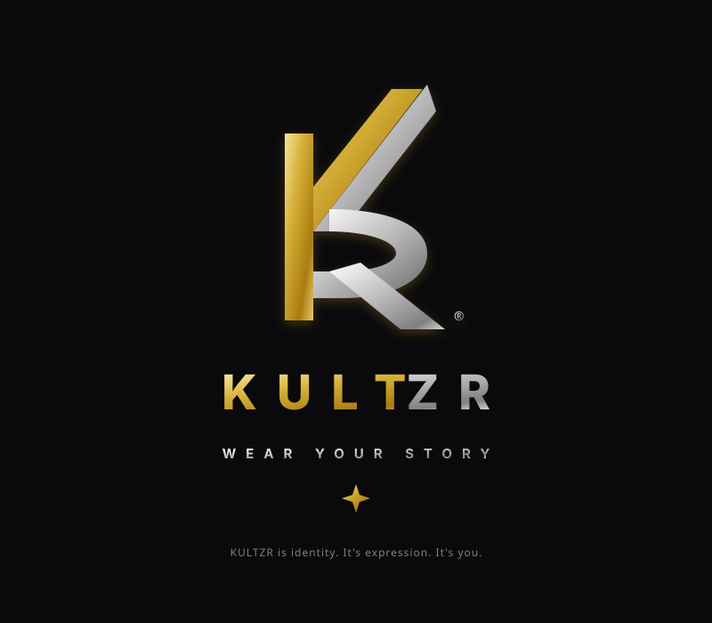

# KultZR – Wear Your Story | Zero-Inventory Luxury Apparel Platform



> **Wear Your Story. Own Your Culture.**  
> An unapologetic, zero-inventory luxury streetwear brand and bespoke 2D customizer studio engineered on Next.js 16, Supabase PostgreSQL, Razorpay payments, and Qikink Print-on-Demand (POD) fulfillment.

---

## 🌟 Key Features

1. **Bespoke 2D Customizer Studio (`/customize`)**:
   - Real-time typography rendering (*Montserrat, Inter, Playfair Display, Cinzel*).
   - Custom graphic upload and vector emblem presets (*Quill & Thread, Phoenix Crest, Minimalist Sun, Heritage Knot*).
   - Interactive placement toggle (*Front Chest, Back Center, Sleeve Accent*) with instant shareable custom design URL generator.

2. **Zero-Inventory POD Fulfillment (`src/lib/podAdapter.ts`)**:
   - Integrated **Qikink POD Provider Adapter** for 350+ products, 2,750+ SKUs, zero MOQ, COD support, and express delivery across 29,000+ Indian pincodes.
   - Webhook trigger on Razorpay payment success sending print orders straight to Qikink.
   - Pluggable architecture ready for **Printful / Printify** global fulfillment.

3. **AI Product Curation Pipeline (`/api/ai/enrich`)**:
   - Hugging Face Inference API / Open LLM integration generating SEO luxury titles, storytelling copy, and 240 GSM organic cotton fabric specifications from user designs.

4. **Live Cloud Database (Supabase PostgreSQL)**:
   - Live tables: `profiles`, `categories`, `products`, `product_provider`, `customizations`, `orders`, `order_items`, `newsletter_subscribers`.
   - Row Level Security (RLS) policies protecting user data.

5. **Razorpay Payment Gateway Integration**:
   - Server-side Razorpay order generation (`/api/checkout`) and client-side popup SDK (`RazorpayModal.tsx`).
   - Sandbox test key (`rzp_test_TQ7Cdpi6W4Balz`) with test mode guidance banner.

6. **Authentication & Account Dashboard (`/account`)**:
   - Supabase JWT authentication (`AuthModal.tsx` & `authContext.tsx`).
   - Profile management and live user order history tracking.

7. **Order Tracking & Atelier Merchant Portal**:
   - `/track`: Guest real-time parcel tracking lookup.
   - `/admin/orders`: Merchant atelier order queue with status updates (*Processing -> Printing -> Shipped -> Delivered*).

---

## 🛠️ Tech Stack & Services

- **Frontend**: Next.js 16 (App Router, Turbopack, React 19), Tailwind CSS v4, Lucide Icons, Canvas Confetti.
- **Backend / Database**: Supabase (PostgreSQL 15, Auth, Storage, Row Level Security).
- **Payments**: Razorpay Node SDK & Client Popup Modal.
- **POD Fulfillment**: Qikink Open REST API (`qikink.com`).
- **AI Engine**: Hugging Face Inference API (`Mistral-7B-Instruct`).
- **Hosting**: Vercel Serverless & CDN (`vercel.json`).

---

## 🚀 Getting Started

### 1. Clone Repository & Install Dependencies
```bash
git clone https://github.com/codgamerofficial/KultZR.git
cd KultZR
npm install
```

### 2. Environment Setup (`.env.local`)
Create `.env.local` in the project root with the following keys:

```env
# Supabase Configuration
NEXT_PUBLIC_SUPABASE_URL=https://thkztuyvpbwwwkppofuf.supabase.co
NEXT_PUBLIC_SUPABASE_ANON_KEY=your-supabase-anon-key
SUPABASE_SERVICE_ROLE_KEY=your-supabase-service-role-key

# Razorpay Payment Gateway Configuration
NEXT_PUBLIC_RAZORPAY_KEY_ID=rzp_test_TQ7Cdpi6W4Balz
RAZORPAY_KEY_SECRET=4w6VDRwpcsW7NKo4001pabPw

# Qikink Print-on-Demand (POD) API Configuration
QIKINK_API_KEY=your-qikink-api-key
QIKINK_API_SECRET=your-qikink-api-secret
QIKINK_API_URL=https://api.qikink.com/v2

# Hugging Face AI Catalog Curation Token (Optional)
HUGGINGFACE_API_TOKEN=your-huggingface-api-token

# Base Application URL
NEXT_PUBLIC_APP_URL=http://localhost:3000
NEXT_PUBLIC_ENV=development
```

### 3. Run Development Server
```bash
npm run dev
```
Open [http://localhost:3000](http://localhost:3000) (or `http://localhost:3001` if port 3000 is occupied) in your browser.

### 4. Build for Production
```bash
npm run build
npm start
```

---

## 🔒 Legal & GST Registration

- **Brand Entity**: KultZR Apparel & Co.
- **GSTIN Registration**: 27AAACK1234F1Z9
- **Policy Pages**: `/about`, `/shipping`, `/guarantee`, `/terms`, `/privacy`

---

## 📜 License
© {new Date().getFullYear()} KultZR – Wear Your Story. All rights reserved.
